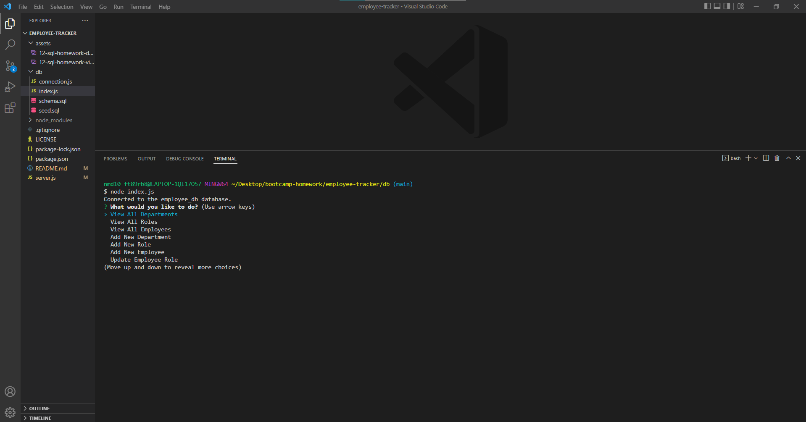

# Employee Management System

## Description
In this application the user will be able to view an edit multiple different aspects of the employee database. The user will launch the application in the integrated terminal using "node index.js". The user will be met with a variety of options to choose from, based of their answer the user will be able to view all departments, view all roles, view all employees, add a new department, add a new role, add a new employee, or update an existing employee. If the user chooses to add new information or update pre-existing information they will be met with another series of questions that will take the user input and either add that information to the table or update the pre-existing information in the table.

# Table of Contents

[Installation](#installation)

[Technology](#technology)

[License](#license)

[Video Demonstration](#video-demonstration)

[Questions](#questions)

## Installation
To install this application please clone the repo to your individual device. To launch the application simply open the integrated terminal type "npm i" to install the necessary npms to your device and then type "node index.js" to launch the initial questions.

## Technology
This application was created using the following technology
- npm inquirer
- npm mysql2
- npm path
- npm dotenv

## License 
***Please note this application is covered under license MIT***

## Video Demonstration

Watch video demonstration [here](https://drive.google.com/file/d/12tbVNKz8KfzvI1Ukx80mKlI9w0eG2zGg/view)

## Questions

If there are any additional questions please e-mail me at <nmd1018@yahoo.com>
